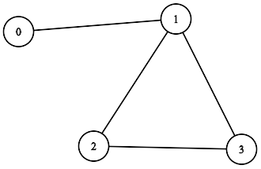
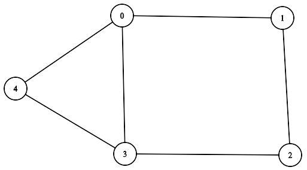

# Finding Adjacent Nodes

## Challenge

A graph is a set of nodes and edges that connect those nodes.


There are two types of graphs; directed and undirected. In an undirected graph, the edges between nodes have no particular direction (like a two-way street) whereas in a directed graph, each edge has a direction associated with it (like a one-way street).

For two nodes in a graph to be considered adjacent to one another, there must be an edge between them. In the example given above, nodes 0 and 1 are adjacent, but nodes 0 and 2 are not.

We can encode graphs using an adjacency matrix. An adjacency matrix for a graph with "n" nodes is an "n * n" matrix where the entry at row "i" and column "j" is a 0 if nodes "i" and "j" are not adjacent, and 1 if nodes "i" and "j" are adjacent.

For the example above, the adjacency matrix would be as follows:

```python
[
  [ 0, 1, 0, 0 ],
  [ 1, 0, 1, 1 ],
  [ 0, 1, 0, 1 ],
  [ 0, 1, 1, 0 ]
]
```

A one indicates that a connection is true and a zero indicates a connection is false.

Here is how the above model might be written out:

- On the first row, node 0 does not connect to itself, but it does connect to node 1. It does not connect to node 2 or node 3. The row is written as 0, 1, 0, 0.
- On the second row, node 1 connects to node 0, node 2 and node 3, but it does not connect to itself. The row is written as 1, 0, 1, 1.
- On the third row, node 2 does not connect to node 0, but it does connect to node 1, does not connect to itself, and it does connect to node 3. The row is written as 0, 1, 0, 1
- On the fourth row, node 3 does not connect to node 0, but it does connect to node 1 and node 2. It does not connect to itself. The row is written as 0, 1, 1, 0.

Your task is to determine if two nodes are adjacent in a graph when given the adjacency matrix and the two nodes.

### Notes

- Graphs may have between 0 and 25,000 nodes.
- Time Limit: 100 milliseconds.

## Pseudocode

```pseudocode
function are_nodes_adjacent(node1, node2, matrix):
	current_node_connections = matrix[node1]
	sought_connection = current_node_connections[node2]
	return bool(sought_connection)
```

## Tests



Adjacency Matrix:

```python
[
  [ 0, 1, 0, 0 ],
  [ 1, 0, 1, 1 ],
  [ 0, 1, 0, 1 ],
  [ 0, 1, 1, 0 ]
]
```

- Nodes `0,1` should return `True`.
- Nodes `0,2` should return `False`.



```python
[
  [ 0, 1, 0, 1, 1 ],
  [ 1, 0, 1, 0, 0 ],
  [ 0, 1, 0, 1, 0 ],
  [ 1, 0, 1, 0, 1 ],
  [ 1, 0, 0, 1, 0 ]
]
```

- Nodes `0,3` should return `True`.
- Nodes `1,4` should return `False`.
